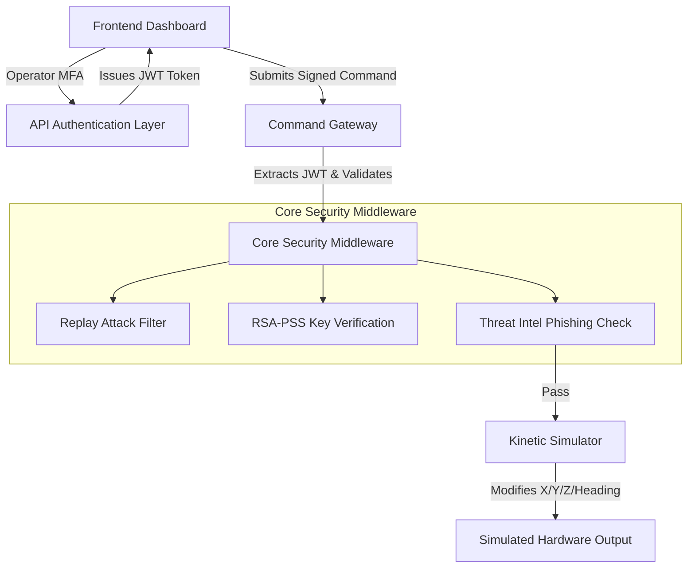

# CryptoGuard-R: Full Project Synopsis

## 1. Executive Summary

**CryptoGuard-R** is a comprehensive, enterprise-grade Cybersecurity framework specifically engineered to protect active robotic hardware swarms (Unmanned Aerial Vehicles and Ground Rovers) from advanced, Artificial Intelligence-powered phishing attacks, network interception, and adversarial data payloads. 

At its core, the project bridges the gap between traditional Cryptography and emerging AI threats by combining **zero-trust biometric architecture** (Facial verification), **provable cryptographic signatures** (RSA-2048-PSS), and an active **Natural Language Threat Engine** (TF-IDF modeling).

---

## 2. System Architecture

The CryptoGuard-R framework is divided into multiple high-speed operational layers running asynchronously.

---

## 3. Threat Intelligence: AI-Powered Interceptor

Traditional firewalls inspect packet headers; CryptoGuard-R inspects the psychological intent of the payload. Recognizing that human engineers operating control panels can be subjected to advanced AI-generated phishing attacks (e.g., fraudulent emails demanding urgent system overrides), the platform employs a linguistic safety net.

- **The Engine**: Uses NLTK for morphological linguistic tokenization (Stopword removal, Lemmatization) and a Scikit-Learn **Logistic Regression Model** fueled by **TF-IDF matrices** (Term Frequency-Inverse Document Frequency) trained on historical spam/phishing datasets.
- **The Execution**: When a command is routed to the robot (e.g., from an email instructing a technician to move a crate), the origin context is passed to the ML Engine.
- **The Result**: If the phrase semantics score above `0.70` for deception or urgency, the robot natively rejects the execution, shielding against social-engineered overrides.

---

## 4. Multi-Factor Kinetic Biometrics

To execute any function, the system demands absolute proof of the operator's physical presence to eliminate remote hijacking.

- **Step 1: Authorization Mapping**: The user supplies an authorized `Operator ID` (such as `CG-001`).
- **Step 2: OpenCV Local Binary Pattern Histograms (LBPH)**: A raw video stream is fed from the operator's physical hardware. Using local Haar Cascade classifiers, the backend captures a specific grid-mesh of the person's face. 
- **Session Locking**: A JSON Web Token (JWT) is minted *only* if the mathematical confidence score of the current face matches the Operator's baseline registration. If the operator closes their browser or clicks logout, the JWT is shredded, returning the system to a Zero-Trust state.

---

## 5. The Cryptographic Core

CryptoGuard-R heavily relies on modern cryptographic primitives. Data obfuscation is not enough; absolute origin verification is required.

> [!IMPORTANT]
> **Asymmetric Origin Verification (RSA-2048 PSS)**
> * Every single micro-command (e.g. `MOVE_FORWARD 50`) passed to the Command Gateway is independently packaged and hashed via **SHA-256**.
> * The frontend signs this hash using the system's Private Key using **RSA-PSS** (Probabilistic Signature Scheme). 
> * Why PSS instead of PKCS#1 v1.5? Because PSS uses a randomized salt parameter. Signing the identical message `"STOP"` fifty times produces fifty entirely unique cryptographic signatures, inherently rendering adaptive chosen-ciphertext attacks irrelevant.

> [!WARNING]
> **Replay Attack Neutralization**
> * If an adversary captures a perfectly signed command and attempts to re-transmit it to the server later to disrupt logistics, the Command Gateway utilizes temporal hashing.
> * The hashed payload matrix `Hash(Message | Signature)` is logged into the memory with a 5-minute Time-To-Live. Duplicate mathematical exacts are rejected completely as `[REPLAY_DETECTED]`.

---

## 6. Enterprise Multi-Robot Simulation

The project features a full Python-based mathematical simulation backend that physically restricts the hardware actions inside defined operational "Geofences".

### Operational Modes
1. **ROVER MODE (Ground AGV)**
   - Utilizes X and Y coordinate trigonometry for mapping grid spaces.
   - Bound by a strict 50x50 meter Geofence matrix. Attempting to force the Rover outside these bounds triggers an automated system halt.
   
2. **UAV MODE (Aerial Drone)**
   - Unlocks the Z-Axis constraints (`ASCEND` / `DESCEND` functions).
   - Introduces FAA-compliant Geofence thresholds (hard limit of `200m` maximum altitude). Moving beyond this ceiling triggers a severe `Operational Boundary Exceeded` error and physically refuses the movement.

---

## 7. UX / Visual Strategy

CryptoGuard-R does not depend on heavy external web-frameworks like React or Angular resulting in massive dependencies. Instead, it relies on highly-optimized, raw Vanilla Javascript paired with a high-end "Glassmorphism" Corporate layout. 

Components exist in modular, dynamic tabs (Control Matrix, Threat Intel, Cryptographic Core) meaning zero page-flashes during complex cryptographic logging validations. 

### Conclusion
CryptoGuard-R is a holistic look at modern hardware security—where firewalls are replaced by Biometrics, physical Geofencing, Probability-based Cryptography, and active Artificial Intelligence interception frameworks.
